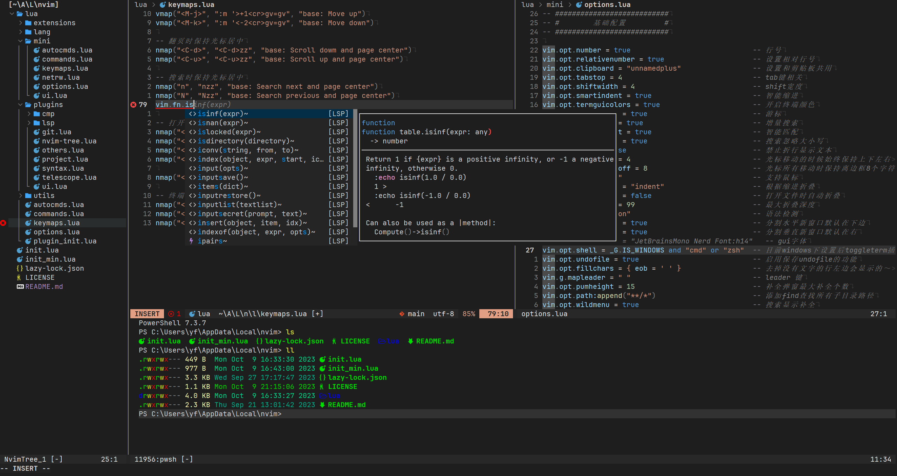

# Nvim

**一个自定义配置的Neovim可用版本**



## 特性

* 轻量ide，开发lua、rust等
* 非常非常非常懒加载，使用[lazy.vim](https://github.com/folke/lazy.nvim)插件管理，优化每个插件的启动方式
* 内部包含一个无插件的配置

## 依赖

* Neovim >= **0.8.0** 
* Git >= **2.19.0** 
* [Nerd Font](https://www.nerdfonts.com/) 字体 **_(可选)_**
* [nodejs](https://nodejs.org/) (预览markdown)
* c 编译工具 (用于编译nvim-treesitter)
* [fd](https://github.com/sharkdp/fd) (文件查找)
* [ripgrep](https://github.com/BurntSushi/ripgrep) (模糊搜索)
* [lazygit](https://github.com/jesseduffield/lazygit) (git管理)

## 安装

### Windows

* 在powershell下安装
```powershell
git clone https://github.com/follow1123/nvim $env:LOCALAPPDATA\nvim
```
### Linux
```bash
git clone https://github.com/follow1123/nvim ~/.config/nvim
```

## 项目结构

```cmd
.
├── lua
│   ├── extensions              自定义扩展功能
│   ├── mini                    无插件配置
│   ├── lang                    语言功能，类似ftplugin
│   ├── autocmds.lua            自动命令
│   ├── commands.lua            自定义命令
│   ├── keymaps.lua             按键映射
│   ├── options.lua             基础配置
│   ├── plugin_init.lua         插件初始化
│   ├── plugins                 插件目录
│   │   ├── cmp                 补全功能插件
│   │   │   ├── format.lua
│   │   │   ├── init.lua
│   │   │   ├── keymap.lua
│   │   │   └── source.lua
│   │   ├── git.lua             git功能插件
│   │   ├── lsp                 LSP功能插件
│   │   │   ├── init.lua
│   │   │   ├── keymap.lua
│   │   │   └── lang
│   │   │       └── lua_ls.lua
│   │   ├── nvim-tree.lua       目录树插件
│   │   ├── others.lua          其他插件
│   │   ├── project.lua         项目管理相关插件
│   │   ├── syntax.lua          语法相关插件
│   │   ├── telescope.lua       telescope插件
│   │   └── ui.lua              ui相关插件
│   └── utils                   工具
├── init.lua                    nvim配置入口
└── init_min.lua                无插件配置入口
```

### 无插件配置使用方式

#### windows

```cmd
nvim -u %LOCALAPPDATA%\nvim\init_min.lua
```

#### linux

```bash
nvim -u ~/.config/nvim/init_min.lua
```

## 按键映射
> 使用[which-key](https://github.com/folke/which-key.nvim)插件管理按键

### 基础按键

* `<M-1>` 切换目录树
* `<M-4>` 切换底部终端
* `<M-6>` 切换lazygit终端
* `<C-f>` 在当前buffer内搜索文本
* `<M-f>` 在当前项目内搜索文件

### leader按键

#### 代码相关`<leader>c` 

* `<leader>ca` 执行lsp的code action操作
* `<leader>cf` 代码格式化

#### LSP `<leader>l` 

* `<leader>lp` 预览代码诊断信息
* `<leader>ls` 列出当前buffer内的所有符号
* `<leader>lS` 列出当前项目内的所有符号

#### Buffer `<leader>b` 

* `<leader>bb` 切换到上一个buffer，和`<C-^>`一样
* `<leader>bf` 列出当前的buffer

#### File 文件相关 `<leader>f`

* `<leader>ff` 模糊搜索当前项目内的所有文本

#### Git `<leader>g`

* `<leader>gr` 还原当前的修改
* `<leader>gd` 分屏对比当前的修改
* `<leader>gb` 显示当前提交人信息

#### Help `<leader>h`
> 帮助内大部分使用telescope的搜索框

* `<leader>hh` 高亮帮助
* `<leader>hk` 按键映射帮助
* `<leader>hf` 帮助搜索

#### Project `<leader>p`

* `<leader>pf` 列出最近打开的项目并搜索
* `<leader>po` 打开一个项目

## 参考

* [Neovim-from-scratch](https://github.com/LunarVim/Neovim-from-scratch)
* [LazyVim](https://github.com/LazyVim/LazyVim)
